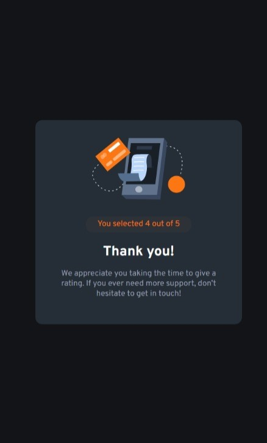

# Frontend Mentor - Interactive rating component solution

This is a solution to the [Interactive rating component challenge on Frontend Mentor](https://www.frontendmentor.io/challenges/interactive-rating-component-koxpeBUmI). Frontend Mentor challenges help you improve your coding skills by building realistic projects. 

## Table of contents

- [Overview](#overview)
  - [The challenge](#the-challenge)
  - [Screenshot](#screenshot)
- [My process](#my-process)
  - [Built with](#built-with)
  - [What I learned](#what-i-learned)
- [Author](#author)

## Overview

### The challenge

Users should be able to:

- View the optimal layout for the app depending on their device's screen size
- See hover states for all interactive elements on the page
- Select and submit a number rating
- See the "Thank you" card state after submitting a rating

### Screenshot

## My process

### Built with

- HTML3
- CSS custom properties
- Flexbox
- jQuery

### What I learned

I learned about cascading and in which order does the styles will be applied. I also learned how to go to another web page by clicking a button. My solution has a problem which is about rating number in thank you state. I couldn't fix it. It was supposed to work!

## Author

- Github - [Razie](https://github.com/raziie)
- Frontend Mentor - [@raziie](https://www.frontendmentor.io/profile/raziie)
